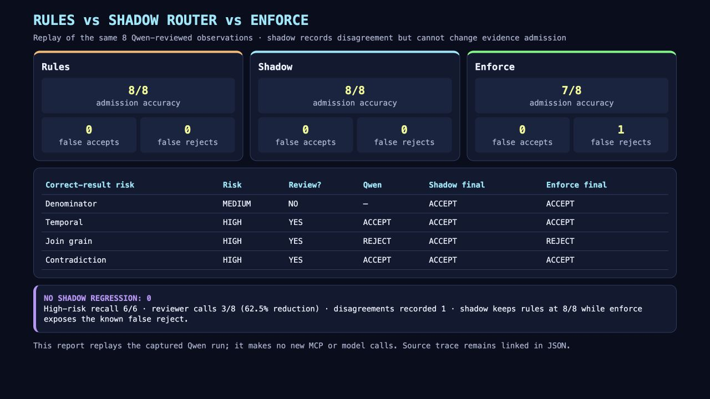
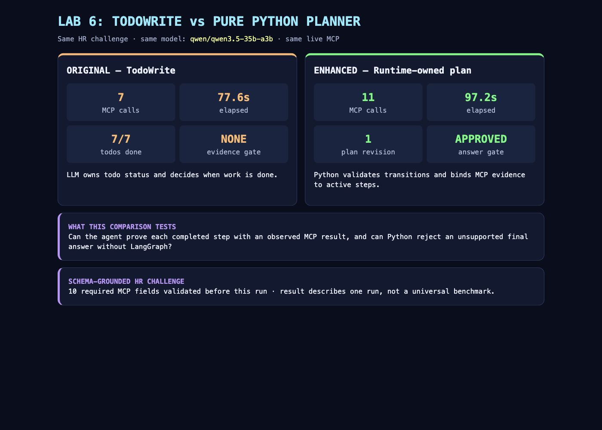
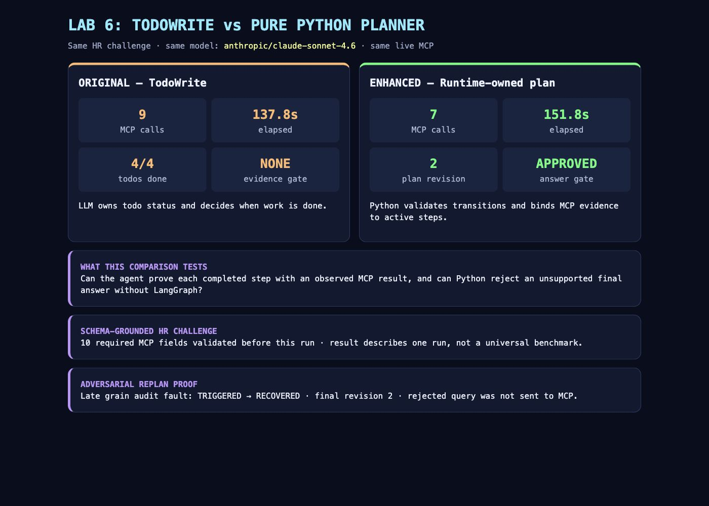
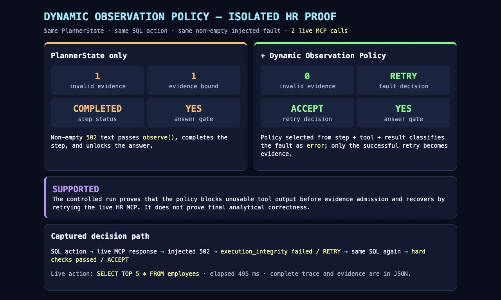
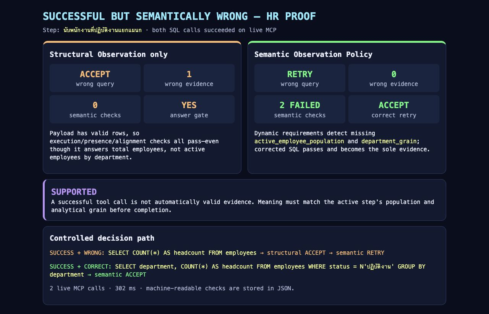
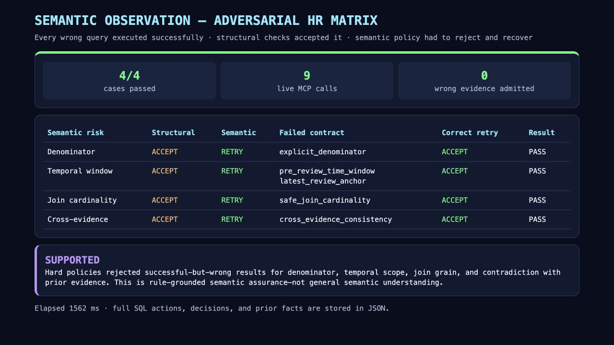
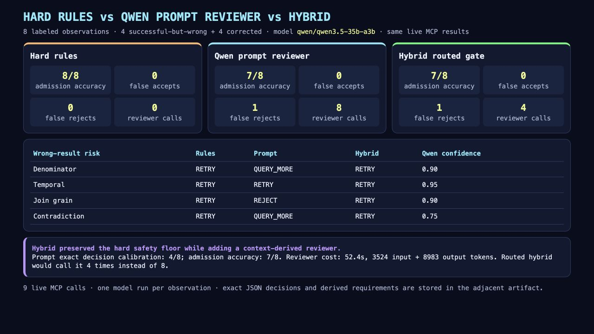

# v2-Python-Agent-LangGraph

## ถ้าจะรัน Agent ตัวล่าสุด ให้ทำตามนี้

มีสองอย่างที่มักสับสนกัน:

- `run-agent-*` = **รัน Agent จริง** เรียก Qwen และ HR MCP แล้วแสดง plan/tool/observation/answer ใน terminal
- `compare-*` = รันหรือ replay การทดลองเพื่อสร้างไฟล์เปรียบเทียบ ไม่ใช่ตัว Agent สำหรับถามงานทั่วไป

### 1. ติดตั้งครั้งแรก

รันจาก root ของ repository:

```bash
conda create -n agentic-ai python=3.11 -y
conda activate agentic-ai
pip install -r requirements.txt
cp .env.example .env
```

เปิด `.env` แล้วใส่สามค่านี้:

```dotenv
OPENROUTER_API_KEY=คีย์ OpenRouter ของคุณ
OPENROUTER_MODEL=qwen/qwen3.5-35b-a3b
MCP_SERVER_URL=https://your-server.example/mcp
```

### 2. รัน Agent จริง

เข้า conda environment และ root repository ก่อน แล้วรันไฟล์ Python โดยตรง:

```bash
conda activate agentic-ai
cd v2-Python-Agent-LangGraph

python labs/lab6_todo/agent_planner.py
```

คำสั่งนี้รัน [agent_planner.py](labs/lab6_todo/agent_planner.py) ด้วยโจทย์ HR ตัวอย่าง
ใน Rules mode Agent จะสร้างแผน, เรียก MCP, ตรวจ Observation, ผูก Evidence และแสดง
คำตอบใน terminal ตัว agent ใช้ schema ที่ MCP เปิดให้ จึงถามโดเมนอื่นในฐานเดียวกันได้
เช่นตารางสินเชื่อ โดย HR เป็นเพียงโจทย์ default และชุด benchmark ของ repository

ถ้าต้องการทดลอง Shadow Router ตัวล่าสุด:

```bash
python labs/lab6_todo/agent_planner.py --routing-mode shadow
```

Shadow จะเรียก Qwen reviewer เฉพาะผล high risk แต่ reviewer เปลี่ยน Evidence decision
ไม่ได้ จึงเหมาะสำหรับทดลองตอนนี้ ส่วนคำสั่งนี้ยังไม่แนะนำให้ใช้เป็น default:

```bash
python labs/lab6_todo/agent_planner.py --routing-mode enforce
```

เปรียบเทียบไฟล์เดิมกับไฟล์ปรับปรุง:

```bash
python labs/lab6_todo/agent_todo.py     # TodoWrite ของเดิม
python labs/lab6_todo/agent_planner.py  # Planner + Observation รุ่นล่าสุด
```

### 3. ถามโจทย์ของตัวเอง

`make run-agent*` ใช้โจทย์ HR default หากต้องการส่งคำถามเอง ให้รัน:

```bash
python labs/lab6_todo/agent_planner.py --routing-mode shadow \
  "นับพนักงานที่ปฏิบัติงานแยกแผนก และอธิบาย denominator ที่ใช้"
```

คำสั่ง `make run-agent`, `make run-agent-shadow` และ `make run-agent-enforce`
ยังใช้ได้ แต่เป็นเพียงคำสั่งลัดของ Python commands ข้างบน

### 4. ถ้าแค่ต้องการตรวจว่าโค้ดผ่านหรือดูผลทดลอง

```bash
make test                     # unit/regression tests; ไม่เรียก Qwen หรือ MCP
make compare-shadow-router-hr # replay ผลที่บันทึกไว้; ไม่เรียก Qwen หรือ MCP
```

ผลภาพล่าสุดอยู่ที่
[`artifacts/lab6_hr_shadow_router_comparison.png`](artifacts/lab6_hr_shadow_router_comparison.png)

> สรุป: เริ่มที่ `python labs/lab6_todo/agent_planner.py`; ถ้าต้องการ Shadow ให้เพิ่ม
> `--routing-mode shadow`; คำสั่ง `compare-*` มีไว้พิสูจน์/วัดผล ไม่ใช่การคุยกับ Agent

## Pure Python Evidence-driven Agent

แกนหลักของ repository คือการสร้าง agent runtime ด้วย Pure Python ให้เห็นกลไกทุกชิ้น
ตั้งแต่ model → tool → observation → plan → evidence → answer gate โดยไม่ต้องพึ่ง
orchestration framework:

- Python เป็นเจ้าของ `PlannerState` และตรวจ state transition
- Dynamic Observation Policy เลือก hard checks จาก active step + tool + result type
- Runtime สร้าง dynamic goal contract ก่อนวางแผนและส่งชื่อ dimension, metric,
  population constraint ที่ต้องใช้ให้ model; failed checks คืน actionable SQL fix
- MCP result ถูกผูกกับ active step เป็น evidence เฉพาะเมื่อ observation ตัดสิน `accept`
- step ที่ไม่มีหลักฐานเปลี่ยนเป็น `completed` ไม่ได้
- accepted observation ทำให้ Python auto-complete active step; model ไม่ต้องจัดการ
  transition เชิงกล และ replan เปิดหรือลบ completed evidence เดิมไม่ได้
- analytical contract กำหนด aggregation grain และสูตรเดียวกันทุก Agent
- validator ปฏิเสธ SQL ที่เสี่ยง fan-out และทำให้ Planner แก้แผน
- final answer ผ่านได้เมื่อ runtime gate อนุมัติเท่านั้น
- `shadow/enforce` ตรวจ final answer เทียบ accepted MCP evidence อีกครั้ง; `enforce`
  block ตัวเลขหรือข้อกล่าวอ้างที่ไม่ได้ grounded และสั่ง rewrite/query เพิ่มได้

```text
LLM proposes action
→ Python validates state + analytical contract
→ MCP executes
→ dynamic observation: accept / retry / query_more / reject
→ risk router: low / medium / high
→ optional Qwen reviewer: shadow or enforce
→ Python binds accepted evidence
→ reject / replan / continue
→ answer gate → final semantic reviewer (shadow or enforce)
```

### สถานะล่าสุด: Rules + Shadow Risk Router

เวอร์ชันล่าสุด **ไม่ใช่ LangGraph** และไม่ให้ Qwen reviewer ตัดสินทุกผลลัพธ์
Runtime ใช้ hard rules เป็น authority แล้ว route เฉพาะ observation ความเสี่ยงสูงไปให้
Qwen ตรวจ semantics เพิ่ม:

```text
Tool result
→ Structural checks
→ Hard semantic rules
→ Risk Router
   ├─ low/medium: ใช้ hard decision
   └─ high: เรียก independent Qwen reviewer
→ rules/shadow/enforce กำหนดอำนาจของ reviewer
→ Evidence Gate → PlannerState → Answer Gate
```

| Mode | ใช้เมื่อ | ผลของ Qwen reviewer |
| --- | --- | --- |
| `rules` | ค่า default เพื่อ backward compatibility | ไม่เรียก reviewer |
| `shadow` | **แนะนำสำหรับทดลอง/สะสมข้อมูลตอนนี้** | review observation + final answer แต่ไม่ block |
| `enforce` | งานทดลองเท่านั้น | block high-risk evidence และ final synthesis ที่ไม่ grounded; ยังอาจ false reject |

```bash
# พฤติกรรมเดิมและเร็วที่สุด
python labs/lab6_todo/agent_planner.py

# โหมดล่าสุดที่แนะนำให้ผู้เรียนทดลอง
python labs/lab6_todo/agent_planner.py --routing-mode shadow

# ยังไม่แนะนำเป็น default
python labs/lab6_todo/agent_planner.py --routing-mode enforce
```

หลักฐานล่าสุดจาก observations ชุดเดียวกัน: Rules 8/8, Shadow 8/8,
Shadow behavior regression = 0, high-risk recall 6/6 และลด reviewer calls 62.5%
ส่วน Enforce ได้ 7/8 เพราะ Qwen false reject corrected join หนึ่งครั้ง



> `shadow` ยังมี latency/token cost เมื่อพบ high risk แต่ไม่ทำให้ evidence decision
> เปลี่ยนจาก rules ส่วน `enforce` ยังต้องสะสมผลหลายโจทย์และหลาย runs ก่อนใช้งานจริง

### คำสั่งทดสอบและ benchmark เพิ่มเติม

คำสั่งด้านล่างไม่ใช่ Agent runner แต่ใช้ตรวจ regression หรือสร้างหลักฐานการทดลอง:

```bash
make test                           # ไม่เรียก Qwen/MCP
make compare-shadow-router-hr       # replay artifact; ไม่เรียก Qwen/MCP
make proof-pure-planner             # Evidence Gate + MCP จริง
make compare-lab6-hr                # TodoWrite vs Pure Python Planner
make compare-observation-policy-hr  # error-level observation proof
make compare-semantic-observation-hr
make compare-semantic-matrix-hr
make compare-prompt-observation-hr  # ใช้ Qwen reviewer 8 calls
```

ผลทดลองและ captured screens ใช้ `qwen/qwen3.5-35b-a3b` คำสั่งที่เรียก API อ่าน
endpoint/key จาก `.env` ผ่าน `python-dotenv`; คีย์จริงไม่ถูกเก็บใน artifacts หรือ source

### เปรียบเทียบ Lab 6 TodoWrite กับ Pure Python Planner

การเปรียบเทียบหลัก **ไม่ใช้ LangGraph** ทั้งสองฝั่ง ใช้ agent loop ที่เขียนด้วย
Pure Python, คำถาม HR, model, MCP และ analytical contract ชุดเดียวกัน:

| เวอร์ชัน | ใครควบคุมสถานะและเงื่อนไขจบ |
| --- | --- |
| Lab 6 เดิม — TodoWrite | LLM เขียน todo, เปลี่ยน status และตัดสินใจจบเอง |
| Lab 6 Enhanced — Pure Python Planner | Python runtime ตรวจ transition, ผูก MCP evidence และควบคุม answer gate |

```bash
make validate-hr-challenges
make compare-lab6-hr                                      # default: skills_project_risk
make compare-lab6-hr HR_CHALLENGE=mobility_outcomes
make compare-lab6-hr HR_CHALLENGE=training_effectiveness
make compare-lab6-hr-adversarial HR_CHALLENGE=skills_project_risk
```

Runner วัด MCP calls, latency, todo completion, plan revision, evidence coverage และ
answer-gate status แล้วสร้าง:

- `artifacts/lab6_hr_comparison_<challenge>.json`
- `artifacts/lab6_hr_comparison_<challenge>.html`

ผล Qwen comparison ปกติ:



| Metric | Qwen TodoWrite | Qwen Pure Python Planner |
| --- | ---: | ---: |
| MCP calls | 7 | 11 |
| ระยะเวลา | 77.564 วินาที | 97.163 วินาที |
| Completed | todo 7/7 | plan 9/9 |
| Final revision | ไม่มี | 1 |
| Answer gate | ไม่มี | APPROVED |

### HR challenges และ analytical contract

โจทย์ benchmark ไม่ได้แต่งขึ้นลอย ๆ แต่สกัดจากหัวข้อที่ชุมชน People Analytics
พูดถึงจริง เช่น การเชื่อม training กับ outcomes, internal mobility และการเชื่อม
skills/workforce metrics กับ business value จาก
[r/analytics: HR Analytics](https://www.reddit.com/r/analytics/comments/13utqxk/hr_analytics/),
[People Analytics work](https://www.reddit.com/r/analytics/comments/1r40o7l/what_does_people_analytics_work_actually_look/)
และ [SHRM: People Analytics](https://www.shrm.org/in/executive-network/insights/how-chros-can-power-up-their-people-analytics--)

มี 3 challenge ให้เลือก:

| Challenge | คำถามที่ทดสอบ | ตารางหลัก |
| --- | --- | --- |
| `skills_project_risk` | risk matrix: project value สูง แต่ skill/training coverage ต่ำ | employees, skills, training, reviews, projects |
| `mobility_outcomes` | เทียบผลลัพธ์ของกลุ่มที่มี/ไม่มี internal mobility | employees, position history, training, reviews, projects |
| `training_effectiveness` | ความสัมพันธ์ระหว่าง training hours ก่อน review กับคะแนนล่าสุด | employees, training, reviews |

ก่อน benchmark ให้ยืนยันกับ MCP สดว่า field ที่โจทย์ต้องใช้มีจริง และ preflight query
มีข้อมูลเพียงพอ:

```bash
make validate-hr-challenges
make compare-lab6-hr                                      # default: skills_project_risk
make compare-lab6-hr HR_CHALLENGE=mobility_outcomes
make compare-lab6-hr HR_CHALLENGE=training_effectiveness
```

สำหรับ `skills_project_risk` ทั้งสอง Agent ต้องใช้ grain และสูตรเดียวกัน: aggregate
ตารางลูกเป็นหนึ่งแถวต่อพนักงานก่อน join, คำนวณ flags `f1–f5` จาก SQL และใช้
HIGH ≥ 4, MEDIUM 2–3, LOW ≤ 1 หาก query ผิด contract จะถูกปฏิเสธก่อนเรียก MCP
และ Pure Planner จะเพิ่ม revision เพื่อทำงานต่อ

คำสั่ง `compare-lab6-hr-adversarial` เปิด fault injection หนึ่งครั้งในจังหวะ query
รวมหลายตาราง เพื่อพิสูจน์ว่า runtime ปฏิเสธ action, เพิ่ม revision และให้ Agent สร้าง
query ใหม่ได้จริง แยกผลไว้ที่ `artifacts/lab6_hr_adversarial_*`

ผล adversarial captured run:



| Metric | Qwen TodoWrite + contract | Qwen Pure Python Planner + contract |
| --- | ---: | ---: |
| MCP calls | 3 | 16 |
| ระยะเวลา | 44.581 วินาที | 752.206 วินาที |
| Injected late grain rejection | ไม่ได้ทดสอบ runtime recovery | TRIGGERED |
| Final revision | ไม่มี | 6 |
| Completed steps | todo 4/5 | plan 2/2 |
| Answer gate | ไม่มี | APPROVED |

หลักฐานสำคัญ: validator ปฏิเสธ query ก่อนส่งไป MCP, Planner แก้แผนจน revision 6,
สร้าง query ใหม่ แล้วได้ risk matrix `f1–f5` ตาม contract เดียวกับ baseline จนครบ

### ข้อสรุป: วิธีใหม่ดีกว่าของเดิมหรือไม่

ผลนี้ **ยังไม่พิสูจน์ว่า Pure Python Planner ดีกว่า TodoWrite ในทุกด้าน** ของเดิม
เร็วกว่าและใช้ MCP calls น้อยกว่าอย่างชัดเจน ส่วน Planner ใหม่ให้ execution assurance
สูงกว่า: บังคับ evidence ต่อขั้น, ป้องกันการจบก่อนงานครบ, ตรวจ analytical contract
และฟื้นตัวจาก action ที่ถูกปฏิเสธได้

| สิ่งที่ผลทดลองรองรับ | ข้อสรุป |
| --- | --- |
| Latency และ MCP calls | TodoWrite ดีกว่า |
| Completion discipline | Pure Python Planner ดีกว่า |
| Evidence traceability | Pure Python Planner ดีกว่า |
| Recovery หลัง runtime rejection | Pure Python Planner พิสูจน์ได้ |
| Numerical correctness | ยังสรุปไม่ได้ |
| คุณภาพ business insight | ยังสรุปไม่ได้ |
| Overall intelligence | ยังสรุปไม่ได้ |
| Production readiness | ต้องทดสอบเพิ่มทั้งคู่ |

ข้อจำกัดของข้อสรุปนี้คือเป็น single run และ adversarial fault injection ใช้พิสูจน์
recovery path ของ Planner ไม่ใช่ head-to-head correctness test ที่สมบูรณ์ จึงควรตีความว่า
วิธีใหม่เหมาะกับงานที่ความผิดพลาดหรือการจบไม่ครบมีต้นทุนสูง แต่ overhead ปัจจุบัน
ยังมากเกินไปสำหรับเปิดใช้กับทุกคำถาม

### Dynamic Observation Policy: พิสูจน์จังหวะ Observation โดยตรง

Evidence gate รุ่นแรกยังมีช่องโหว่: `observe()` ยอมรับ tool result ทุกข้อความที่ไม่ว่าง
ดังนั้นข้อความ error เช่น `502 Bad Gateway` ก็สามารถถูกผูกเป็น evidence, complete step
และผ่าน answer gate ได้ การเพิ่ม planner หรือ prompt อย่างเดียวไม่แก้ปัญหานี้

`observation_policy.py` เลือก policy modules แบบ dynamic จาก 3 inputs:

```text
active PlanStep + tool capability + tool result type
→ execution_integrity / payload_presence / step_tool_alignment
→ schema_coverage หรือ result_shape/population_and_grain ตามบริบท
→ accept / retry / query_more / reject
```

รัน controlled experiment ซึ่งใช้ PlannerState และ SQL action เดียวกันทั้งสองฝั่ง:

```bash
make compare-observation-policy-hr
```



| Metric | PlannerState only | + Dynamic Observation Policy |
| --- | ---: | ---: |
| Live HR MCP calls ใน protocol | 2 | ใช้ protocol เดียวกัน |
| Invalid `502` evidence accepted | 1 | 0 |
| Fault decision | implicit accept | `retry` |
| Successful retry decision | ไม่มี observation | `accept` |
| Answer gate | ผ่านด้วย invalid evidence | ผ่านด้วย successful evidence เท่านั้น |

การทดลองนี้ตั้งใจ **ไม่เรียก LLM** เพื่อ isolate ตัวแปร Observation โดยไม่ให้ sampling
ของ planner ปนผล: เรียก `execute_query_tool` กับ MCP จริงก่อน, แทนผลรอบแรกด้วย
non-empty 502 แบบ deterministic, แล้วให้ทั้งสอง runtime ประเมิน payload เดียวกัน
Dynamic Policy ปฏิเสธ fault ก่อน evidence admission และ retry SQL เดิมกับ MCP จริงสำเร็จ

สิ่งที่ผลนี้พิสูจน์คือ evidence-admission และ recovery mechanism เท่านั้น ยังไม่พิสูจน์
numerical correctness, คุณภาพคำตอบ HR หรือความฉลาดโดยรวม ส่วน end-to-end Qwen A/B
ที่ลองระหว่างพัฒนาไม่ถูกใช้เป็นหลักฐาน เพราะแผนที่ model สุ่มได้ต่างกันและ baseline
ชนเพดาน 60 turns ทำให้ไม่สามารถระบุสาเหตุของผลต่างว่าเกิดจาก Observation เพียงตัวเดียว

ไฟล์หลักฐาน:

- `artifacts/lab6_hr_dynamic_observation_policy.json` — MCP calls, policy modules, checks และ state
- `artifacts/lab6_hr_dynamic_observation_policy.html` — รายงานที่เปิดซ้ำได้
- `artifacts/lab6_hr_dynamic_observation_policy.png` — captured screen ของรายงาน

#### Successful-but-wrong: ตรวจความหมาย ไม่ใช่แค่ execution

proof ที่สองใช้ active step ว่า `นับพนักงานที่ปฏิบัติงานแยกแผนก` แล้วเรียก MCP
ด้วย SQL ที่ execute สำเร็จและคืน row จริง แต่ตอบเพียงจำนวนพนักงานทั้งหมด:

```sql
SELECT COUNT(*) AS headcount FROM employees
```

Structural Observation ยอมรับผลนี้ เพราะ execution, payload และ tool alignment ผ่าน
แต่ Semantic Observation สร้าง requirements จาก step แบบ dynamic แล้วพบว่าไม่มี
`active_employee_population` และ `department_grain` จึงตัดสิน `retry` ก่อนผูก evidence
จากนั้น SQL ที่มี `WHERE status = N'ปฏิบัติงาน' GROUP BY department` ผ่านเป็น `accept`

```bash
make compare-semantic-observation-hr
```



| Metric | Structural Observation | Semantic Observation |
| --- | ---: | ---: |
| SQL ผิด execute สำเร็จ | ใช่ | ใช่ |
| Decision ต่อ SQL ผิด | `accept` | `retry` |
| Wrong evidence accepted | 1 | 0 |
| Missing active-population filter | ไม่ตรวจ | ตรวจพบ |
| Missing department grain | ไม่ตรวจ | ตรวจพบ |
| Corrected retry | ไม่จำเป็นตาม gate เดิม | `accept` |

ขอบเขตปัจจุบันยังเป็น hard semantic contract สองชนิด ไม่ใช่ semantic understanding
ทั่วไป ขั้นถัดไปควรเพิ่ม denominator, temporal window, join cardinality และ
cross-evidence contradiction โดยมี adversarial case และ expected decision แยกกัน

#### Semantic adversarial matrix 4 ประเภท

เพิ่ม policy และ controlled case อีกสี่ประเภทแล้ว แต่ละ wrong query ต้อง execute สำเร็จ
บน MCP จริง, ผ่าน structural checks และถูก semantic policy ปฏิเสธก่อน evidence admission:

```bash
make compare-semantic-matrix-hr
```



| Semantic risk | Structural decision | Semantic decision | Corrected retry |
| --- | ---: | ---: | ---: |
| Percentage ไม่มี denominator | `accept` | `retry` | `accept` |
| Training ไม่ผูก pre-review/latest-review window | `accept` | `retry` | `accept` |
| Raw multi-satellite join ทำให้ fan-out | `accept` | `retry` | `accept` |
| Metric ขัดกับ prior evidence | `accept` | `retry` | `accept` |

ผลรวม: 4/4 cases ผ่าน, 9 live MCP calls และ wrong evidence admitted = 0

Cross-evidence policy อ่าน numeric facts จาก evidence ก่อนหน้า แล้วเปรียบเทียบเฉพาะ
metric key ที่ตรงกัน ส่วน policy อื่นตรวจ SQL semantics ที่อนุมานจาก active step
ทั้งหมดเป็น deterministic hard policy จึงตรวจซ้ำได้และไม่ให้โมเดลลดเกณฑ์เอง

ข้อจำกัดยังคงสำคัญ: นี่คือ **rule-grounded semantic assurance** สำหรับ contract ที่
ประกาศไว้ ไม่ใช่ open-ended semantic understanding หากโจทย์ใช้ถ้อยคำหรือ SQL pattern
นอก vocabulary ปัจจุบัน ต้องเพิ่ม contract/parser หรือใช้ semantic reviewer อีกชั้น

#### System-prompt Semantic Reviewer เทียบกับ Rules และ Hybrid

`semantic_reviewer.py` เป็น reviewer call แยก context จาก actor ใช้ system prompt เป็น
meta-policy ให้ Qwen derive requirements จาก goal, active step, contract, SQL, raw result
และ prior facts เอง ผลจาก tool ถูกระบุเป็น untrusted data และ reviewer คืน structured JSON
เท่านั้น ส่วน Hybrid ใช้กติกา `hard FAIL → veto`; reviewer ไม่มีสิทธิ์ override hard gate

```bash
make compare-prompt-observation-hr
make run-agent-shadow  # reviewer ไม่มีสิทธิ์ block
make run-agent-enforce # reviewer block high risk ได้
```



| Metric | Hard rules | Qwen prompt reviewer | Hybrid routed gate |
| --- | ---: | ---: | ---: |
| Admission accuracy | 8/8 | 7/8 | 7/8 |
| Exact decision calibration | 8/8 | 4/8 | 7/8 |
| False accepts | 0 | 0 | 0 |
| False rejects | 0 | 1 | 1 |
| Reviewer calls | 0 | 8 | 4 |
| Reviewer latency | ≈0 | 52.434 วินาที | ประมาณ 23.212 วินาที |
| Tokens | 0 | 3,524 input + 8,983 output | ลดลงด้วย routing |

Qwen เข้าใจ denominator, temporal window, fan-out และ contradiction ได้โดยไม่ต้องใช้
regex แต่ false reject corrected join หนึ่งครั้ง เพราะสร้าง requirement เพิ่มเองว่า skills
และ projects ต้องถูก join แบบตารางดิบ ทั้งที่วิธีแก้ aggregate แยกต่อ employee ก่อน join
เป็นวิธีป้องกัน fan-out ที่ถูกต้อง นี่แสดงว่า prompt มีความ dynamic จริง แต่ความยืดหยุ่น
สร้าง over-interpretation ได้ด้วย

ข้อสรุปจาก run นี้จึงไม่ใช่ “prompt ดีกว่า rules” แต่เป็น:

- Known invariants ใช้ hard rules แม่นกว่า เร็วกว่า และตรวจซ้ำได้
- Unknown/ambiguous semantics ใช้ prompt reviewer เพื่อ derive checks เพิ่ม
- Production path ควร route reviewer หลัง hard checks ผ่าน ไม่เรียกทุก tool result
- Reviewer fail ควร block แบบ provisional และเปิดทาง verification/review ไม่ควรถือเป็น truth

ผลนี้เป็น Qwen single run บน 8 labeled observations ไม่ใช่ universal model benchmark
รายละเอียด requirements, checks, confidence, latency และ tokens อยู่ใน JSON artifact

#### Shadow Risk Router: เพิ่มความ dynamic โดยไม่เปลี่ยนผลเดิม

`observation_router.py` ประเมิน `low / medium / high` จาก semantic requirements และ
SQL signals เช่น window function หรือ multi-satellite join แล้วมีสามโหมด:

| Mode | Reviewer | สิทธิ์เปลี่ยน evidence decision |
| --- | --- | --- |
| `rules` | ไม่เรียก | ไม่มี—ใช้ hard decision เดิม |
| `shadow` | เรียกเฉพาะ high risk ที่ hard checks ผ่าน | ไม่มี—บันทึก disagreement เท่านั้น |
| `enforce` | เรียกเฉพาะ high risk ที่ hard checks ผ่าน | มี—ต้องผ่านทั้ง hard และ reviewer |

```bash
make run-agent         # rules; default
make run-agent-shadow  # shadow
make run-agent-enforce # enforce
make compare-shadow-router-hr
```


| Metric | Rules | Shadow | Enforce |
| --- | ---: | ---: | ---: |
| Admission accuracy | 8/8 | 8/8 | 7/8 |
| False accepts | 0 | 0 | 0 |
| False rejects | 0 | 0 | 1 |
| Behavior regression จาก rules | — | 0 | 1 |

Router จับ declared high-risk observations ได้ 6/6, ลด reviewer calls จาก 8 เหลือ 3
(62.5%) และพบ disagreement 1 ครั้ง โดย Shadow ไม่เปลี่ยน evidence admission จึงยัง
รักษาผล 8/8 ส่วน Enforce เปิดเผย false reject เดิมของ corrected join ตามที่คาดไว้

รายงาน Shadow เป็น deterministic replay ของ Qwen/MCP trace ที่บันทึกก่อนหน้า ไม่ได้
อ้างว่าเป็น model run ใหม่ ข้อดีคือเปรียบเทียบ routing modes บน observations เดียวกัน
แบบไม่มี sampling noise; ข้อจำกัดคือยังต้องสะสม shadow runs หลายโจทย์ก่อนพิจารณาเปิด
`enforce` เป็นค่าเริ่มต้น ดังนั้น default ปัจจุบันยังเป็น `rules`

### LangGraph (optional comparison)

Lab 8 เก็บไว้เพื่อให้ผู้เรียนเห็นว่า framework ห่อ state graph และ routing อย่างไร
ไม่ใช่แกนหลักของ enhancement หรือ benchmark ใน README นี้ รายละเอียดและคำสั่งรันอยู่ที่
[`labs/lab8_langgraph/README.md`](labs/lab8_langgraph/README.md)

> หลักสูตร **Agentic AI Development with Python (หลักสูตรที่ 2)** —
> เขียน Agent runtime ด้วย Pure Python ทีละขั้น (Lab 1–7), ดู framework comparison แบบ optional (Lab 8) และ deploy เป็น API Service (Lab 9)

repo นี้เป็นชุดแล็บ **9 Lab** ที่ต่อเนื่องกัน สอนตั้งแต่เรียก LLM ครั้งแรก จนถึง deploy Agent เป็น API + Docker
ทุก Lab เชื่อมกับ **MCP MSSQL Server จริง** ของหลักสูตรที่ 1 เป็นแกนข้อมูลเดียวกัน

---

## เอกสารในโปรเจกต์นี้ต่างกันอย่างไร (อ่านไฟล์ไหนก่อน)

repo นี้มี README หลายระดับ แต่ละไฟล์ตอบคนละคำถาม — เลือกอ่านตามว่าคุณอยากรู้อะไร:

| ไฟล์ | ตอบคำถามว่า | เหมาะกับใคร |
| --- | --- | --- |
| **`README.md` (ไฟล์นี้)** | "โปรเจกต์นี้คืออะไร โครงสร้าง repo เป็นแบบไหน จะเริ่มอ่านที่ไหน" — ภาพรวมระดับ repo + จุดเริ่มต้น | คนเปิด repo ครั้งแรก |
| [`labs/README.md`](labs/README.md) | "หลักสูตรมีกี่ Lab เรียงยังไง **เส้นทางการเรียนรู้** ไล่จาก Lab 1 ถึง 9 อย่างไร ติดตั้ง/รันยังไง" — สารบัญ + เส้นเรื่องการสอน + setup/run | ผู้เรียน/ผู้สอนที่จะเดินตามหลักสูตร |
| `labs/labN_*/README.md` | "Lab นี้มีจุดประสงค์อะไร รันยังไง โค้ดจุดสำคัญอยู่ตรงไหน" — รายละเอียดเชิงลึกราย Lab | คนที่กำลังทำ Lab นั้นอยู่ |

> สรุปสั้น: **ไฟล์นี้ = ประตูหน้าระดับ repo** (โครงสร้าง + ชี้ทาง) · **`labs/README.md` = สารบัญ + เส้นเรื่องหลักสูตร + setup/run** · **README ราย Lab = คู่มือลงมือทำของแต่ละ Lab**

---

## เริ่มต้น (Clone Repository)

```bash
git clone https://github.com/aekanun2020/v2-Python-Agent-LangGraph.git
cd v2-Python-Agent-LangGraph
```

> **ขั้นตอนติดตั้งสภาพแวดล้อม (conda env + `.env` + dependencies) และวิธีรันแต่ละ Lab อยู่ใน [`labs/README.md`](labs/README.md)** — โดย Setup เต็มเป็นแหล่งเดียว (single source) อยู่ที่ [Lab 1](labs/lab1_setup/README.md) ทำครั้งเดียวก่อนเริ่มทุก Lab (พัฒนา/ทดสอบด้วย **Miniconda**, Python 3.11)

---

## โครงสร้างโปรเจกต์

```
Python-Agent-LangGraph/
├── README.md                   # ไฟล์นี้ — ภาพรวมระดับ repo + ชี้ทาง
├── labs/
│   ├── README.md               # สารบัญ Lab 1–9 + เส้นทางการเรียนรู้ + setup/run
│   ├── core/                   # โค้ดกลางที่ทุก Lab ใช้ร่วมกัน (config/llm/mcp_client/registry)
│   ├── lab1_setup/             # Lab 1: ตรวจสภาพแวดล้อม (เจ้าของ Setup เต็ม)
│   ├── lab2_llm/               # Lab 2: เรียก LLM + เทียบโมเดล
│   ├── lab3_agent_loop/        # Lab 3: agent loop แรก (Pure Python)
│   ├── lab4_mcp_agent/         # Lab 4: + MCP MSSQL จริง
│   ├── lab5_skills/            # Lab 5: + Skill routing (มีโฟลเดอร์ skills/)
│   ├── lab6_todo/              # Lab 6: + TodoWrite
│   ├── lab7_memory/            # Lab 7: + Memory/Compaction/Note-taking
│   ├── lab8_langgraph/         # Lab 8: optional framework comparison
│   └── lab9_deploy/            # Lab 9: ห่อ agent เป็น FastAPI API + Docker
├── docker-compose.yml          # Lab 9: service agent (ชี้ MCP MSSQL จริงผ่าน .env)
├── .dockerignore
├── discover_mssql.py           # ยูทิลิตี้ตรวจการเชื่อมต่อ + list tools/args schema
├── screenshots/labs/           # ภาพหน้าจอผลการรันทดสอบจริง (Lab 1–9)
│   ├── lab1_check_env.png ... lab7_memory.png
│   ├── lab8_01_mssql_discovery.png / lab8_02_agent_q1.png / lab8_03_agent_q2.png
│   ├── lab9_api_deploy.png
│   └── layer_coverage_matrix.png   # ตารางแมป layer สถาปัตยกรรม × Lab
├── requirements.txt
├── .env.example                # เทมเพลต env (ไม่มีคีย์จริง)
├── .gitignore
└── (README.md)
```

---

## สถาปัตยกรรม Agent: App → Agent → LLM + 8 Layers

เพื่อให้เข้าใจว่าแต่ละ Lab "กำลังสร้างชิ้นส่วนไหนของ Agent" repo นี้ยึดภาพสถาปัตยกรรมเดียวกันทั้งหลักสูตร
หัวใจคือ **LLM ทำหน้าที่ reasoning/decision** แต่สิ่งที่ทำให้มันเป็น "Agent" และประกอบขึ้นเป็น "App" จริง
คือ layer ที่ห่อรอบ LLM ต่างหาก

```
┌──────────────────────────────────────────────┐
│                    APP                         │
│  + UI, Auth, DB, Business Logic, Infra         │
│  ┌──────────────────────────────────────────┐ │
│  │              AGENT                        │ │
│  │  + Memory, Tools, Hooks, State            │ │
│  │   ┌────────────────────────────────┐      │ │
│  │   │           LLM                  │      │ │
│  │   │  (reasoning / decision)        │      │ │
│  │   └────────────────────────────────┘      │ │
│  └──────────────────────────────────────────┘ │
└──────────────────────────────────────────────┘
```

กางภาพข้างบนออกเป็น **8 layer** ของ Agent harness — แต่ละ layer มีคำอธิบายและ **แหล่งอ้างอิงต้นทาง** (origin paper / เอกสารทางการของบริษัทเทคโนโลยี) ที่เข้าดูได้จริง:

| # | Layer | ทำหน้าที่อะไร | แหล่งอ้างอิงต้นทาง (เปิดดูได้จริง) |
| :-: | --- | --- | --- |
| 1 | **Instructions / Bootstrap** | คำสั่งระบบ/บุคลิก/ขอบเขตที่โหลดตอนเริ่ม (เช่น `SOUL.md`, `AGENTS.md`) — กำหนดพฤติกรรมก่อนโมเดลเห็นงาน | Anthropic — [Effective context engineering for AI agents](https://www.anthropic.com/engineering/effective-context-engineering-for-ai-agents) |
| 2 | **Memory** | ความจำสั้น/ยาว/procedural + compaction + note-taking | CoALA: [Cognitive Architectures for Language Agents](https://arxiv.org/abs/2309.02427) (Sumers et al., 2024) · Anthropic — [context engineering: compaction & note-taking](https://www.anthropic.com/engineering/effective-context-engineering-for-ai-agents) |
| 3 | **Tools + Skills** | ความสามารถภายนอก (MCP) + procedure ที่นำกลับมาใช้ซ้ำ (Skills) โหลดตามความจำเป็น | Anthropic — [Introducing the Model Context Protocol](https://www.anthropic.com/news/model-context-protocol) · [Agent Skills (Claude Docs)](https://platform.claude.com/docs/en/agents-and-tools/agent-skills/overview) |
| 4 | **Hooks** | callback ที่ดักจังหวะ lifecycle ของ agent (เช่น `PreToolUse`/`PostToolUse`/`Stop`) เพื่อ log/บล็อก/แทรก context แบบ deterministic | Anthropic — [Claude Code Hooks reference](https://code.claude.com/docs/en/hooks) |
| 5 | **Reasoning Loop (Agent Loop)** | วงคิด-ทำ-สังเกต (reason → act → observe → วน) แกนของ agent | ReAct: [Synergizing Reasoning and Acting in Language Models](https://arxiv.org/abs/2210.03629) (Yao et al., ICLR 2023) |
| 6 | **Sandbox + Execution** | ที่รันโค้ด/คำสั่งที่โมเดลสร้างขึ้นแบบแยกขอบเขต (Docker/VM/Computer Use) | Anthropic — [Computer use tool](https://docs.anthropic.com/en/docs/agents-and-tools/tool-use/computer-use-tool) · [Code execution with MCP](https://www.anthropic.com/engineering/code-execution-with-mcp) |
| 7 | **Gateway + Scheduler** | ช่องทางเข้า-ออกประตูเดียว (HTTP/Telegram/Slack) + ตัวกระตุ้นตามเวลา/เหตุการณ์ (Cron/Webhook) | **Gateway:** AWS — [Amazon Bedrock AgentCore Gateway: single secure entry point for agents](https://docs.aws.amazon.com/bedrock-agentcore/latest/devguide/gateway.html) · วิชาการ: Nowaczyk — [Architectures for Building Agentic AI](https://arxiv.org/abs/2512.09458) (แนวคิด Execution Gateway) · **Scheduler:** Dust — [Introducing Triggers (Schedule + Webhook)](https://dust.tt/blog/introducing-triggers-your-agents-working-while-you-sleep) |
| 8 | **Safety Layer** | permission gating, audit trail, self-check + containment ที่ environment layer | Anthropic — [How we contain Claude across products](https://www.anthropic.com/engineering/how-we-contain-claude) |

> หมายเหตุ: CoALA (layer 2), ReAct (layer 5) และ Architectures for Building Agentic AI (layer 7) เป็น academic paper · MCP/Skills/Hooks/Computer Use/Containment เป็นเอกสารทางการของ Anthropic · AgentCore Gateway (layer 7) เป็นเอกสาร AWS · Triggers (layer 7) เป็นเอกสาร Dust

### แต่ละ Lab อยู่ตรงไหนของ 8 Layer นี้

สัญลักษณ์: ● = เป็นแกนหลักของ Lab นั้น · ◐ = แตะ/มีบางส่วน · (ว่าง) = ไม่มี

| Layer | L1 | L2 | L3 | L4 | L5 | L6 | L7 | L8 | L9 |
| --- | :--: | :--: | :--: | :--: | :--: | :--: | :--: | :--: | :--: |
| 1. Instructions / Bootstrap | | | ◐ | ◐ | ● | ◐ | ◐ | ◐ | ◐ |
| 2. Memory | | | | | | | ● | ● | ◐ |
| 3. Tools + Skills | ◐ | | ◐ | ● | ● | ● | ● | ● | ● |
| 4. Hooks | | | | | | | ◐* | | ◐* |
| 5. Reasoning Loop (Agent Loop) | | | ● | ● | ● | ● | ● | ● | ◐ |
| 6. Sandbox + Execution | | | ◐* | | | | | | ◐* |
| 7. Gateway + Scheduler | | | | | | | | | ◐ |
| 8. Safety Layer | | | ◐* | | | | | | ◐ |

> `◐*` = มีร่องรอย/พฤติกรรมคล้าย แต่ยังไม่ใช่ระบบจริงตามนิยาม layer
> **สรุป coverage:** ครบจริง 4 layer (1, 2, 3, 5) · มีบางส่วน 1 layer (7 — มี HTTP gateway แต่ยังไม่มี Telegram/Slack/Cron) · ยังไม่มีจริง 3 layer (4 Hooks, 6 Sandbox/Execution, 8 Safety)
> รายละเอียด gap + เหตุผลว่าทำไม layer 4/6/8 อยู่นอกขอบเขต `course2_outline-1.pdf` อธิบายไว้ที่ [Lab 9 — Layer Coverage & Gaps](labs/lab9_deploy/README.md) (มีภาพ matrix ประกอบ)

README ของแต่ละ Lab จะมีบรรทัด **"ตำแหน่งใน 8 Layer"** บอกว่า Lab นั้นสร้างชิ้นส่วนไหนของภาพนี้

### กรอบ "Agent Harness": repo นี้สร้างอะไร และอยู่ในขอบเขตไหน

**Agent harness** คือ runtime ที่ครอบ LLM ไว้ ทำหน้าที่วน loop เรียกโมเดล → รัน tool → ป้อนผลกลับ → จัดการ context จนงานเสร็จ — ตามที่ Anthropic นิยามว่า agent คือ "ระบบที่ LLM กำกับกระบวนการและการใช้ tool ของตัวเองแบบ dynamic โดยใช้ tool ตาม feedback จาก environment แบบวน loop" ([Anthropic — Building Effective Agents](https://www.anthropic.com/engineering/building-effective-agents))

**repo นี้ = Pure Python single-agent harness ที่ "ถอดประกอบให้เห็นทุกชิ้น"** —
Lab 1–7 เขียน runtime เองผ่านโมดูลกลางใน `labs/core/` และ Lab 9 นำไป deploy:

| ชิ้นส่วน Pure Python harness | ไฟล์/Lab ที่สร้าง | Layer |
| --- | --- | :--: |
| Reasoning loop (while: model→tool→observe) | `lab3_agent_loop` | **5** |
| Tool/skill registry (MCP→OpenAI schema) | `core/registry.py`, `lab4` | **3** |
| Skill routing (Progressive Disclosure) | `lab5_skills` | **3 + 1** |
| Runtime-owned plan + evidence gate | `lab6_todo/agent_planner.py` | **2 + 5** |
| Analytical contract + SQL validator | `scripts/hr_analytical_contract.py` | **5 + 8** |
| Memory + compaction + notes | `lab7_memory` | **2** |
| Prompt/instruction assembly | `core/llm.py`, system prompts | **1** |
| API gateway (FastAPI `/chat`) | `lab9_deploy` | **7** |

**ขอบเขตที่ตั้งใจ: single-agent harness เท่านั้น** — ครบ 4 layer หลัก (1, 2, 3, 5) ตามตาราง coverage ด้านบน ตรงกับ `course2_outline-1.pdf` ทั้งหมด

**สิ่งที่อยู่เหนือกรอบนี้ (ไม่อยู่ใน repo): multi-agent orchestration** — เมื่อโจทย์ซับซ้อนเกินกว่า agent เดียว จึงค่อยเพิ่ม supervisor/worker หรือ orchestrator-workers ([Anthropic — Building Effective Agents](https://www.anthropic.com/engineering/building-effective-agents)) ส่วนนี้เป็น module ถัดไป นอกขอบเขต course2

> สรุป: repo นี้คือ harness ของ agent ตัวเดียวที่สร้างครบ layer 1/2/3/5 และนำไป deploy — multi-agent (supervisor + worker) คือชั้นที่ครอบขึ้นไป ซึ่งเป็นเนื้อหานอก outline ของ course2

---

## หมายเหตุด้านความปลอดภัย

- `.env` (คีย์จริง) ถูก `gitignore` ไว้ — repo นี้มีเฉพาะ `.env.example` ที่ไม่มีคีย์จริง
- ก่อน push ทุกครั้ง ตรวจสอบว่าไม่มีคีย์หลุดเข้าไปในไฟล์ที่ commit
