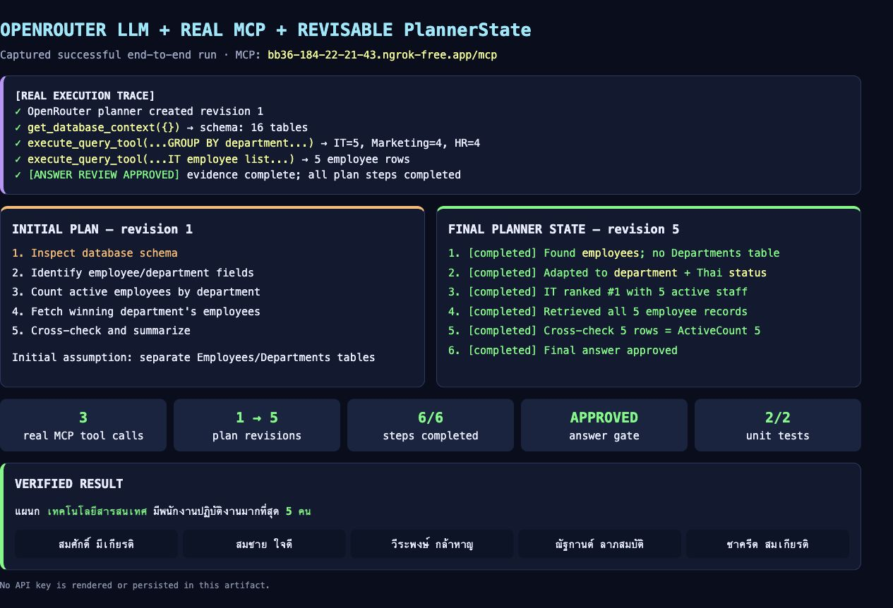
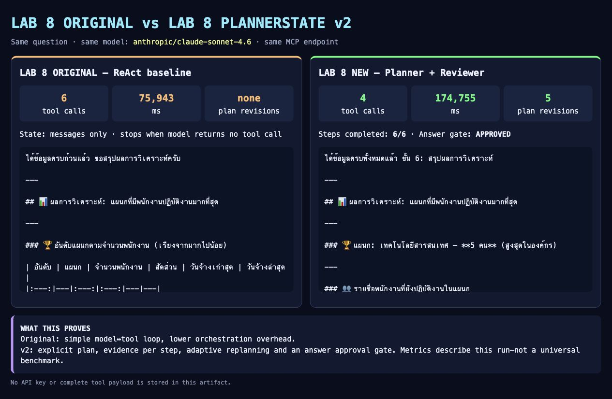
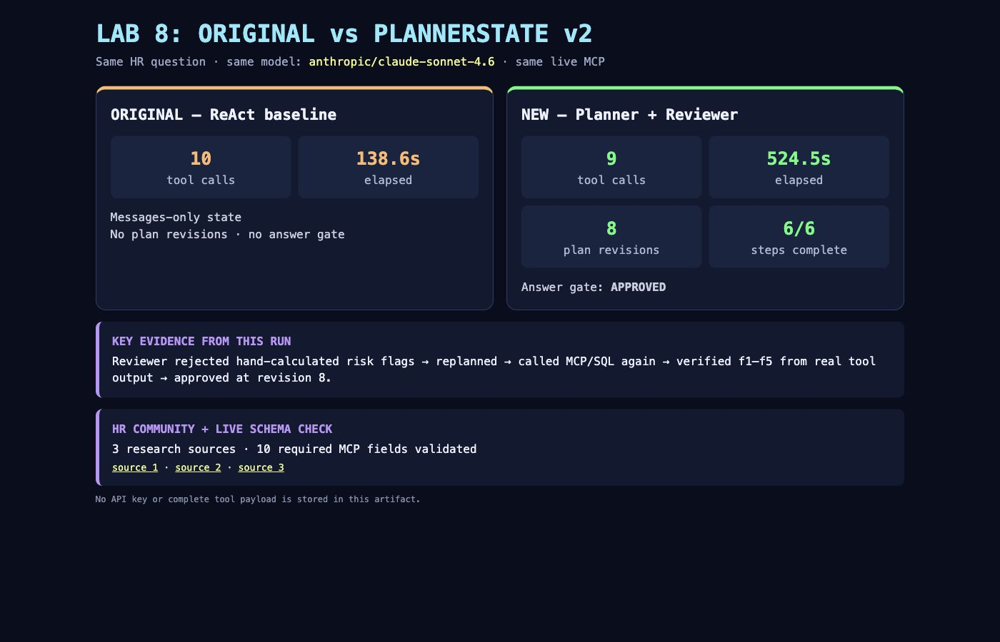

# v2-Python-Agent-LangGraph

## v2 — PlannerState ที่แก้แผนจากหลักฐานจริง

เวอร์ชันนี้เพิ่ม **Planner → Tool → Review → Replan → Answer Review** ให้ Lab 8
เพื่อให้ Agent ไม่ได้เพียงวนเรียก tool แต่มีแผนที่ตรวจสอบและแก้ไขได้ระหว่างทำงาน:

- เก็บ `goal`, `steps`, `status`, `evidence`, `assumptions` และ `revision` ใน `PlannerState`
- Reviewer อ่านผล MCP tool จริงแล้วเปลี่ยนสถานะหรือแก้ลำดับแผน
- คำตอบร่างต้องผ่าน Answer Review; ถ้าหลักฐานไม่ครบ Agent จะได้รับ feedback และทำงานต่อ
- รองรับ dependency injection เพื่อทดสอบ orchestration โดยไม่เสียค่า LLM
- มี unit tests และ proof script ที่เรียก MCP จริง

```text
planner → call_model → tools → capture_tool_result → review_plan ─┐
                    └→ review_answer → APPROVED → END             │
                              └→ REJECTED → call_model ←──────────┘
```

### ผลทดสอบจริง

ภาพนี้มาจากการรัน **OpenRouter LLM จริง + MCP จริง** ไม่ใช่ mock:



ผลที่พิสูจน์ได้: MCP tool calls 3 ครั้ง · plan revision 1 → 5 · completed 6/6 ขั้น ·
Answer Review = APPROVED · unit tests 2/2

### Quick start สำหรับผู้เรียน

พัฒนาและทดสอบด้วย Python 3.11:

```bash
conda create -n agentic-ai python=3.11 -y
conda activate agentic-ai
pip install -r requirements.txt
cp .env.example .env
```

แก้ `.env` แล้วใส่ค่าของตนเอง ห้าม commit คีย์จริง:

```dotenv
OPENROUTER_API_KEY=ใส่คีย์ของผู้เรียน
MCP_SERVER_URL=https://your-mcp-server.example/mcp
```

ตรวจ logic ของ PlannerState โดยไม่เรียก LLM หรือ MCP:

```bash
python -m unittest -v tests.test_lab8_planner
```

พิสูจน์ replanning ด้วย MCP tool จริงโดยไม่ต้องมี LLM key:

```bash
python -m scripts.prove_planner_mcp
```

รัน Agent end-to-end ด้วย OpenRouter Planner/Reviewer และ MCP tools จริง:

```bash
python labs/lab8_langgraph/agent_langgraph.py
```

หรือใช้คำสั่งย่อ:

```bash
make test        # unit tests
make proof       # real MCP, deterministic driver
make run-planner # real OpenRouter + real MCP
make compare-lab8 # รัน Lab 8 เดิมและใหม่ด้วยโจทย์/model/MCP เดียวกัน
make proof-pure-planner # Pure Python evidence gate + MCP จริง ไม่ใช้ LangGraph
```

> `make proof` และ `make run-planner` อ่าน endpoint/key จาก `.env` ผ่าน `python-dotenv`
> คีย์จริงจะไม่ถูกเก็บในภาพหลักฐานหรือ source code

### เปรียบเทียบ Lab 8 เดิมกับ Lab 8 ใหม่

```bash
make compare-lab8
```

คำสั่งนี้รันสอง graph แบบเรียงลำดับโดยใช้คำถาม, `OPENROUTER_MODEL` และ
`MCP_SERVER_URL` ชุดเดียวกัน:

| เวอร์ชัน | State และเงื่อนไขจบ |
| --- | --- |
| Lab 8 เดิม | `messages` อย่างเดียว; จบเมื่อโมเดลไม่เรียก tool |
| Lab 8 ใหม่ | `messages + PlannerState + evidence`; จบเมื่อ Answer Review อนุมัติ |

ผลลัพธ์แสดงจำนวน tool calls, เวลารัน, plan revisions, จำนวนขั้นที่ completed และ
answer-gate status พร้อมสร้างไฟล์ต่อไปนี้อัตโนมัติ:

- `artifacts/lab8_comparison_result.json`
- `artifacts/lab8_comparison_result.html`

ตัวเลขนี้ใช้เปรียบเทียบ execution ของการรันครั้งนั้น ไม่ใช่ benchmark สากล เพราะ LLM
มีความไม่แน่นอนและ latency ของ provider/MCP เปลี่ยนได้ในแต่ละรอบ

ผล captured run วันที่ 18 กรกฎาคม 2026:



| Metric | Lab 8 เดิม | PlannerState v2 |
| --- | ---: | ---: |
| MCP tool calls | 6 | 4 |
| ระยะเวลา | 75.943 วินาที | 174.755 วินาที |
| Plan revisions | ไม่มี | 5 |
| Completed steps | ไม่ได้เก็บ | 6/6 |
| Answer approval gate | ไม่มี | APPROVED |

ผลรอบนี้แสดง trade-off ชัดเจน: v2 ใช้ tool calls น้อยกว่าและมีหลักฐาน/approval
ที่ตรวจสอบได้ แต่ใช้เวลามากกว่าเพราะเพิ่ม LLM calls สำหรับ planning และ review

### เปรียบเทียบด้วยโจทย์ HR ยากที่ตรวจ schema ก่อนรัน

โจทย์ benchmark ไม่ได้แต่งขึ้นลอย ๆ แต่สกัดจากหัวข้อที่ชุมชน People Analytics
พูดถึงจริง เช่น การเชื่อม training กับ outcomes, internal mobility และการเชื่อม
skills/workforce metrics กับ business value จาก
[r/analytics: HR Analytics](https://www.reddit.com/r/analytics/comments/13utqxk/hr_analytics/),
[People Analytics work](https://www.reddit.com/r/analytics/comments/1r40o7l/what_does_people_analytics_work_actually_look/)
และ [SHRM: People Analytics](https://www.shrm.org/in/executive-network/insights/how-chros-can-power-up-their-people-analytics--)

มี 3 challenge ให้เลือก:

| Challenge | คำถามที่ทดสอบ | ตารางหลัก |
| --- | --- | --- |
| `skills_project_risk` | risk matrix: project value สูง แต่ skill/training coverage ต่ำ | employees, skills, training, reviews, projects |
| `mobility_outcomes` | เทียบผลลัพธ์ของกลุ่มที่มี/ไม่มี internal mobility | employees, position history, training, reviews, projects |
| `training_effectiveness` | ความสัมพันธ์ระหว่าง training hours ก่อน review กับคะแนนล่าสุด | employees, training, reviews |

ก่อน benchmark ให้ยืนยันกับ MCP สดว่า field ที่โจทย์ต้องใช้มีจริง และ preflight query
มีข้อมูลเพียงพอ:

```bash
make validate-hr-challenges
make compare-lab8-hr                                      # default: skills_project_risk
make compare-lab8-hr HR_CHALLENGE=mobility_outcomes
make compare-lab8-hr HR_CHALLENGE=training_effectiveness
```

ผล captured run ของ `skills_project_risk` วันที่ 18 กรกฎาคม 2026:



| Metric | Lab 8 เดิม | PlannerState v2 |
| --- | ---: | ---: |
| MCP tool calls | 10 | 9 |
| ระยะเวลา | 138.617 วินาที | 524.543 วินาที |
| Plan revisions | ไม่มี | 8 |
| Completed steps | ไม่ได้เก็บ | 6/6 |
| Answer approval gate | ไม่มี | APPROVED |

จุดพิสูจน์สำคัญของรอบนี้คือ Answer Reviewer ปฏิเสธคำตอบที่คำนวณ risk flags
ด้วยมือ แล้วแก้แผนให้ Agent เรียก MCP/SQL อีกครั้งเพื่อให้ได้ `f1`–`f5` จาก tool
จริงก่อนอนุมัติคำตอบ ผลนี้เป็น single run สำหรับศึกษาพฤติกรรม ไม่ใช่ benchmark สากล
และคำว่าไม่มี skill/training record ไม่ได้พิสูจน์ว่าพนักงานไม่มีทักษะหรือไม่เคยอบรม

> หลักสูตร **Agentic AI Development with Python (หลักสูตรที่ 2)** —
> เขียน Agent ด้วย Pure Python ทีละขั้น (Lab 1–7) แล้วเปรียบเทียบกับ LangGraph (Lab 8) ก่อน deploy เป็น API Service (Lab 9)

repo นี้เป็นชุดแล็บ **9 Lab** ที่ต่อเนื่องกัน สอนตั้งแต่เรียก LLM ครั้งแรก จนถึง deploy Agent เป็น API + Docker
ทุก Lab เชื่อมกับ **MCP MSSQL Server จริง** ของหลักสูตรที่ 1 เป็นแกนข้อมูลเดียวกัน

---

## เอกสารในโปรเจกต์นี้ต่างกันอย่างไร (อ่านไฟล์ไหนก่อน)

repo นี้มี README หลายระดับ แต่ละไฟล์ตอบคนละคำถาม — เลือกอ่านตามว่าคุณอยากรู้อะไร:

| ไฟล์ | ตอบคำถามว่า | เหมาะกับใคร |
| --- | --- | --- |
| **`README.md` (ไฟล์นี้)** | "โปรเจกต์นี้คืออะไร โครงสร้าง repo เป็นแบบไหน จะเริ่มอ่านที่ไหน" — ภาพรวมระดับ repo + จุดเริ่มต้น | คนเปิด repo ครั้งแรก |
| [`labs/README.md`](labs/README.md) | "หลักสูตรมีกี่ Lab เรียงยังไง **เส้นทางการเรียนรู้** ไล่จาก Lab 1 ถึง 9 อย่างไร ติดตั้ง/รันยังไง" — สารบัญ + เส้นเรื่องการสอน + setup/run | ผู้เรียน/ผู้สอนที่จะเดินตามหลักสูตร |
| `labs/labN_*/README.md` | "Lab นี้มีจุดประสงค์อะไร รันยังไง โค้ดจุดสำคัญอยู่ตรงไหน" — รายละเอียดเชิงลึกราย Lab | คนที่กำลังทำ Lab นั้นอยู่ |

> สรุปสั้น: **ไฟล์นี้ = ประตูหน้าระดับ repo** (โครงสร้าง + ชี้ทาง) · **`labs/README.md` = สารบัญ + เส้นเรื่องหลักสูตร + setup/run** · **README ราย Lab = คู่มือลงมือทำของแต่ละ Lab**

---

## เริ่มต้น (Clone Repository)

```bash
git clone https://github.com/aekanun2020/v2-Python-Agent-LangGraph.git
cd v2-Python-Agent-LangGraph
```

> **ขั้นตอนติดตั้งสภาพแวดล้อม (conda env + `.env` + dependencies) และวิธีรันแต่ละ Lab อยู่ใน [`labs/README.md`](labs/README.md)** — โดย Setup เต็มเป็นแหล่งเดียว (single source) อยู่ที่ [Lab 1](labs/lab1_setup/README.md) ทำครั้งเดียวก่อนเริ่มทุก Lab (พัฒนา/ทดสอบด้วย **Miniconda**, Python 3.11)

---

## โครงสร้างโปรเจกต์

```
Python-Agent-LangGraph/
├── README.md                   # ไฟล์นี้ — ภาพรวมระดับ repo + ชี้ทาง
├── labs/
│   ├── README.md               # สารบัญ Lab 1–9 + เส้นทางการเรียนรู้ + setup/run
│   ├── core/                   # โค้ดกลางที่ทุก Lab ใช้ร่วมกัน (config/llm/mcp_client/registry)
│   ├── lab1_setup/             # Lab 1: ตรวจสภาพแวดล้อม (เจ้าของ Setup เต็ม)
│   ├── lab2_llm/               # Lab 2: เรียก LLM + เทียบโมเดล
│   ├── lab3_agent_loop/        # Lab 3: agent loop แรก (Pure Python)
│   ├── lab4_mcp_agent/         # Lab 4: + MCP MSSQL จริง
│   ├── lab5_skills/            # Lab 5: + Skill routing (มีโฟลเดอร์ skills/)
│   ├── lab6_todo/              # Lab 6: + TodoWrite
│   ├── lab7_memory/            # Lab 7: + Memory/Compaction/Note-taking
│   ├── lab8_langgraph/         # Lab 8: LangGraph Agent (pivot — เทียบ Pure Python)
│   └── lab9_deploy/            # Lab 9: ห่อ agent เป็น FastAPI API + Docker
├── docker-compose.yml          # Lab 9: service agent (ชี้ MCP MSSQL จริงผ่าน .env)
├── .dockerignore
├── discover_mssql.py           # ยูทิลิตี้ตรวจการเชื่อมต่อ + list tools/args schema
├── screenshots/labs/           # ภาพหน้าจอผลการรันทดสอบจริง (Lab 1–9)
│   ├── lab1_check_env.png ... lab7_memory.png
│   ├── lab8_01_mssql_discovery.png / lab8_02_agent_q1.png / lab8_03_agent_q2.png
│   ├── lab9_api_deploy.png
│   └── layer_coverage_matrix.png   # ตารางแมป layer สถาปัตยกรรม × Lab
├── requirements.txt
├── .env.example                # เทมเพลต env (ไม่มีคีย์จริง)
├── .gitignore
└── (README.md)
```

---

## สถาปัตยกรรม Agent: App → Agent → LLM + 8 Layers

เพื่อให้เข้าใจว่าแต่ละ Lab "กำลังสร้างชิ้นส่วนไหนของ Agent" repo นี้ยึดภาพสถาปัตยกรรมเดียวกันทั้งหลักสูตร
หัวใจคือ **LLM ทำหน้าที่ reasoning/decision** แต่สิ่งที่ทำให้มันเป็น "Agent" และประกอบขึ้นเป็น "App" จริง
คือ layer ที่ห่อรอบ LLM ต่างหาก

```
┌──────────────────────────────────────────────┐
│                    APP                         │
│  + UI, Auth, DB, Business Logic, Infra         │
│  ┌──────────────────────────────────────────┐ │
│  │              AGENT                        │ │
│  │  + Memory, Tools, Hooks, State            │ │
│  │   ┌────────────────────────────────┐      │ │
│  │   │           LLM                  │      │ │
│  │   │  (reasoning / decision)        │      │ │
│  │   └────────────────────────────────┘      │ │
│  └──────────────────────────────────────────┘ │
└──────────────────────────────────────────────┘
```

กางภาพข้างบนออกเป็น **8 layer** ของ Agent harness — แต่ละ layer มีคำอธิบายและ **แหล่งอ้างอิงต้นทาง** (origin paper / เอกสารทางการของบริษัทเทคโนโลยี) ที่เข้าดูได้จริง:

| # | Layer | ทำหน้าที่อะไร | แหล่งอ้างอิงต้นทาง (เปิดดูได้จริง) |
| :-: | --- | --- | --- |
| 1 | **Instructions / Bootstrap** | คำสั่งระบบ/บุคลิก/ขอบเขตที่โหลดตอนเริ่ม (เช่น `SOUL.md`, `AGENTS.md`) — กำหนดพฤติกรรมก่อนโมเดลเห็นงาน | Anthropic — [Effective context engineering for AI agents](https://www.anthropic.com/engineering/effective-context-engineering-for-ai-agents) |
| 2 | **Memory** | ความจำสั้น/ยาว/procedural + compaction + note-taking | CoALA: [Cognitive Architectures for Language Agents](https://arxiv.org/abs/2309.02427) (Sumers et al., 2024) · Anthropic — [context engineering: compaction & note-taking](https://www.anthropic.com/engineering/effective-context-engineering-for-ai-agents) |
| 3 | **Tools + Skills** | ความสามารถภายนอก (MCP) + procedure ที่นำกลับมาใช้ซ้ำ (Skills) โหลดตามความจำเป็น | Anthropic — [Introducing the Model Context Protocol](https://www.anthropic.com/news/model-context-protocol) · [Agent Skills (Claude Docs)](https://platform.claude.com/docs/en/agents-and-tools/agent-skills/overview) |
| 4 | **Hooks** | callback ที่ดักจังหวะ lifecycle ของ agent (เช่น `PreToolUse`/`PostToolUse`/`Stop`) เพื่อ log/บล็อก/แทรก context แบบ deterministic | Anthropic — [Claude Code Hooks reference](https://code.claude.com/docs/en/hooks) |
| 5 | **Reasoning Loop (Agent Loop)** | วงคิด-ทำ-สังเกต (reason → act → observe → วน) แกนของ agent | ReAct: [Synergizing Reasoning and Acting in Language Models](https://arxiv.org/abs/2210.03629) (Yao et al., ICLR 2023) |
| 6 | **Sandbox + Execution** | ที่รันโค้ด/คำสั่งที่โมเดลสร้างขึ้นแบบแยกขอบเขต (Docker/VM/Computer Use) | Anthropic — [Computer use tool](https://docs.anthropic.com/en/docs/agents-and-tools/tool-use/computer-use-tool) · [Code execution with MCP](https://www.anthropic.com/engineering/code-execution-with-mcp) |
| 7 | **Gateway + Scheduler** | ช่องทางเข้า-ออกประตูเดียว (HTTP/Telegram/Slack) + ตัวกระตุ้นตามเวลา/เหตุการณ์ (Cron/Webhook) | **Gateway:** AWS — [Amazon Bedrock AgentCore Gateway: single secure entry point for agents](https://docs.aws.amazon.com/bedrock-agentcore/latest/devguide/gateway.html) · วิชาการ: Nowaczyk — [Architectures for Building Agentic AI](https://arxiv.org/abs/2512.09458) (แนวคิด Execution Gateway) · **Scheduler:** Dust — [Introducing Triggers (Schedule + Webhook)](https://dust.tt/blog/introducing-triggers-your-agents-working-while-you-sleep) |
| 8 | **Safety Layer** | permission gating, audit trail, self-check + containment ที่ environment layer | Anthropic — [How we contain Claude across products](https://www.anthropic.com/engineering/how-we-contain-claude) |

> หมายเหตุ: CoALA (layer 2), ReAct (layer 5) และ Architectures for Building Agentic AI (layer 7) เป็น academic paper · MCP/Skills/Hooks/Computer Use/Containment เป็นเอกสารทางการของ Anthropic · AgentCore Gateway (layer 7) เป็นเอกสาร AWS · Triggers (layer 7) เป็นเอกสาร Dust

### แต่ละ Lab อยู่ตรงไหนของ 8 Layer นี้

สัญลักษณ์: ● = เป็นแกนหลักของ Lab นั้น · ◐ = แตะ/มีบางส่วน · (ว่าง) = ไม่มี

| Layer | L1 | L2 | L3 | L4 | L5 | L6 | L7 | L8 | L9 |
| --- | :--: | :--: | :--: | :--: | :--: | :--: | :--: | :--: | :--: |
| 1. Instructions / Bootstrap | | | ◐ | ◐ | ● | ◐ | ◐ | ◐ | ◐ |
| 2. Memory | | | | | | | ● | ● | ◐ |
| 3. Tools + Skills | ◐ | | ◐ | ● | ● | ● | ● | ● | ● |
| 4. Hooks | | | | | | | ◐* | | ◐* |
| 5. Reasoning Loop (Agent Loop) | | | ● | ● | ● | ● | ● | ● | ◐ |
| 6. Sandbox + Execution | | | ◐* | | | | | | ◐* |
| 7. Gateway + Scheduler | | | | | | | | | ◐ |
| 8. Safety Layer | | | ◐* | | | | | | ◐ |

> `◐*` = มีร่องรอย/พฤติกรรมคล้าย แต่ยังไม่ใช่ระบบจริงตามนิยาม layer
> **สรุป coverage:** ครบจริง 4 layer (1, 2, 3, 5) · มีบางส่วน 1 layer (7 — มี HTTP gateway แต่ยังไม่มี Telegram/Slack/Cron) · ยังไม่มีจริง 3 layer (4 Hooks, 6 Sandbox/Execution, 8 Safety)
> รายละเอียด gap + เหตุผลว่าทำไม layer 4/6/8 อยู่นอกขอบเขต `course2_outline-1.pdf` อธิบายไว้ที่ [Lab 9 — Layer Coverage & Gaps](labs/lab9_deploy/README.md) (มีภาพ matrix ประกอบ)

README ของแต่ละ Lab จะมีบรรทัด **"ตำแหน่งใน 8 Layer"** บอกว่า Lab นั้นสร้างชิ้นส่วนไหนของภาพนี้

### กรอบ "Agent Harness": repo นี้สร้างอะไร และอยู่ในขอบเขตไหน

**Agent harness** คือ runtime ที่ครอบ LLM ไว้ ทำหน้าที่วน loop เรียกโมเดล → รัน tool → ป้อนผลกลับ → จัดการ context จนงานเสร็จ — ตามที่ Anthropic นิยามว่า agent คือ "ระบบที่ LLM กำกับกระบวนการและการใช้ tool ของตัวเองแบบ dynamic โดยใช้ tool ตาม feedback จาก environment แบบวน loop" ([Anthropic — Building Effective Agents](https://www.anthropic.com/engineering/building-effective-agents))

**repo นี้ = harness ของ single-agent ที่ "ถอดประกอบให้เห็นทุกชิ้น"** — Lab 1–7 เขียนแต่ละชิ้นส่วนของ harness ด้วย Pure Python เอง (ผ่านโมดูลกลางใน `labs/core/`) ก่อนจะเห็นใน Lab 8 ว่า LangGraph ห่อชิ้นส่วนเหล่านั้นให้อย่างไร แล้ว Lab 9 นำไป deploy แต่ละชิ้นส่วน map ตรงกับ 8 layer ด้านบน:

| ชิ้นส่วน harness (เขียนเองใน repo) | ไฟล์/Lab ที่สร้าง | ตรงกับ Layer | LangGraph ห่อให้ (Lab 8) |
| --- | --- | :--: | --- |
| Reasoning loop (while: model→tool→observe) | `lab3_agent_loop` | **5** | `StateGraph` + conditional edge |
| Tool/skill registry (MCP→OpenAI schema) | `core/registry.py`, `lab4` | **3** | `ToolNode` + `MultiServerMCPClient` |
| Skill routing (Progressive Disclosure) | `lab5_skills` | **3 + 1** | conditional edge |
| Plan state (TodoWrite) | `lab6_todo` | **3 → 2** | state ใน `AgentState` |
| Memory + compaction + notes | `lab7_memory` | **2** | `MemorySaver` checkpointer |
| Prompt/instruction assembly | `core/llm.py`, system prompts | **1** | system message ใน state |
| API gateway (FastAPI `/chat`) | `lab9_deploy` | **7** | — (ชั้น deploy) |

**ขอบเขตที่ตั้งใจ: single-agent harness เท่านั้น** — ครบ 4 layer หลัก (1, 2, 3, 5) ตามตาราง coverage ด้านบน ตรงกับ `course2_outline-1.pdf` ทั้งหมด

**สิ่งที่อยู่เหนือกรอบนี้ (ไม่อยู่ใน repo): multi-agent orchestration** — เมื่อโจทย์ซับซ้อนเกินกว่า agent เดียว (context เต็ม, ต้อง parallelize, ต้องการ specialist) จึงขยับเป็นหลาย agent ที่มี supervisor route งานไป worker — LangGraph รองรับ pattern นี้อย่างเป็นทางการ (supervisor / network / hierarchical) ([LangGraph — Multi-Agent Systems](https://langchain-ai.github.io/langgraph/concepts/multi_agent/)) และ Anthropic เรียก pattern คล้ายกันว่า orchestrator-workers ([Anthropic — Building Effective Agents](https://www.anthropic.com/engineering/building-effective-agents)) ส่วนนี้คือ **module ถัดไป นอกขอบเขต outline ของ course2** — ปัจจุบัน repo จึงไม่มี layer สำหรับ sub-agent orchestration

> สรุป: repo นี้คือ harness ของ agent ตัวเดียวที่สร้างครบ layer 1/2/3/5 และนำไป deploy — multi-agent (supervisor + worker) คือชั้นที่ครอบขึ้นไป ซึ่งเป็นเนื้อหานอก outline ของ course2

---

## หมายเหตุด้านความปลอดภัย

- `.env` (คีย์จริง) ถูก `gitignore` ไว้ — repo นี้มีเฉพาะ `.env.example` ที่ไม่มีคีย์จริง
- ก่อน push ทุกครั้ง ตรวจสอบว่าไม่มีคีย์หลุดเข้าไปในไฟล์ที่ commit
